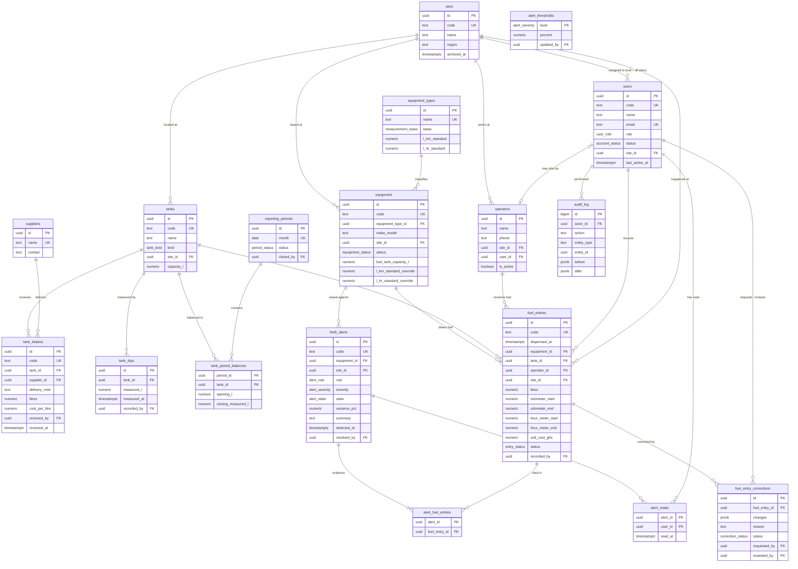

# FuelGuard — Database Schema
Database design for the whole FuelGuard system: every table, how the tables relate, and the rules the data must follow. It is derived from the screens and forms that exist in the app today (Dashboard, Fuel Entry, Tankers, Monthly Summary, Theft Alerts, Equipment & Vehicles, Consumption Standards, Users & Roles, Login).

- **Database:** PostgreSQL (Neon), accessed with Drizzle ORM — see `drizzle.config.ts` and `src/db/`.
- **Status:** implemented in `src/db/schema.ts` (tables, enums, sequences, views) and `src/db/relations.ts`. Initial migration: `drizzle/20260914000829_init/`. Not yet applied to the database — run `yarn db:migrate`.

---

## 1. Conventions

| Topic | Rule |
| --- | --- |
| Primary keys | `id uuid` (default `gen_random_uuid()`). Never shown to users. |
| Human codes | Records people talk about get a separate unique `code` — `EQ-001`, `TNK-01`, `LOG-2400`, `INT-018`, `ALR-118`, `USR-01`. Generated from a Postgres sequence per table, never reused. |
| Naming | `snake_case`, plural table names, foreign keys named `<thing>_id`. |
| Time | `timestamptz`, stored in UTC, displayed in `Africa/Accra`. |
| Litres | `numeric(10,2)` — never floating point. |
| Money (GHS) | `numeric(12,2)`; unit prices `numeric(8,3)`. |
| Rates | L/km `numeric(8,3)`, L/hr `numeric(8,2)`, percentages `numeric(6,2)`. |
| Audit columns | Every table has `created_at`; editable tables also have `updated_at`. |
| Deleting | Business records are never hard-deleted. Reference data is retired with `archived_at` or a `status`; foreign keys use `ON DELETE RESTRICT` unless stated otherwise. |
| Fuel records | `fuel_entries` and `tank_intakes` are **append-only** once submitted. Changes go through an approved correction (§4.6). |

---

## 2. Entity-relationship diagram



---

## 3. Enums

| Enum | Values | Used by |
| --- | --- | --- |
| `user_role` | `administrator`, `records_taker` | `users.role` |
| `account_status` | `active`, `invited`, `disabled` | `users.status` |
| `measurement_basis` | `hours`, `km` | `equipment_types.basis` |
| `equipment_status` | `active`, `maintenance`, `idle`, `retired` | `equipment.status` |
| `tank_kind` | `bulk`, `mobile_bowser`, `day_tank` | `tanks.kind` |
| `period_status` | `open`, `closed` | `reporting_periods.status` |
| `entry_status` | `locked`, `watch`, `flagged` | `fuel_entries.status` |
| `correction_status` | `pending`, `approved`, `rejected` | `fuel_entry_corrections.status` |
| `alert_severity` | `watch`, `high`, `critical` | `alert_thresholds.level`, `theft_alerts.severity` |
| `alert_state` | `open`, `reviewing`, `resolved` | `theft_alerts.state` |
| `alert_rule` | `over_standard`, `exceeds_tank_capacity`, `repeat_top_up`, `no_meter_movement` | `theft_alerts.rule` |

---

## 4. Tables

### 4.1 People and places

#### `sites`
Construction sites. Everything physical — equipment, tanks, people — belongs to one.

| Column | Type | Notes |
| --- | --- | --- |
| `id` | uuid PK | |
| `code` | text UK | `SITE-A` |
| `name` | text not null | `Site A – Kumasi` |
| `region` | text | `Ashanti` |
| `archived_at` | timestamptz | Set instead of deleting. |
| `created_at`, `updated_at` | timestamptz | |

#### `users`
Anyone who can sign in to the portal (Users & Roles page).

| Column | Type | Notes |
| --- | --- | --- |
| `id` | uuid PK | |
| `code` | text UK | `USR-01` |
| `name` | text not null | |
| `email` | text not null | Case-insensitive unique via the `users_email_lower_key` index on `lower(email)` (avoids needing the `citext` extension). |
| `password_hash` | text | Null while `status = invited`. Omit if an auth library owns credentials. |
| `role` | `user_role` not null | Default `records_taker`. |
| `status` | `account_status` not null | Default `invited`. |
| `site_id` | uuid FK → `sites` | **Null means "All sites"** (administrators). |
| `invited_by` | uuid FK → `users` | |
| `last_active_at` | timestamptz | "Last active" column. |
| `created_at`, `updated_at` | timestamptz | |

Check: `role = 'records_taker'` requires `site_id IS NOT NULL`.

> **Auth tables.** If authentication uses a library (Better Auth, Auth.js, etc.), let it generate its own `sessions` / `accounts` / `verification_tokens` tables and link them to `users.id`. If it's built in-house, add `sessions (id, user_id FK, token_hash UK, expires_at, created_at)`.

#### `operators`
Drivers and plant operators who **receive** fuel. They are separate from `users` because most operators never log in; `user_id` links the two when one person is both.

| Column | Type | Notes |
| --- | --- | --- |
| `id` | uuid PK | |
| `name` | text not null | |
| `phone` | text | |
| `site_id` | uuid FK → `sites` | Usual site. |
| `user_id` | uuid FK → `users`, UK, nullable | `ON DELETE SET NULL`. |
| `is_active` | boolean not null | Default `true`. |
| `created_at`, `updated_at` | timestamptz | |

---

### 4.2 Equipment and standards

#### `equipment_types`
One row per equipment type, holding the **default consumption standard** (Consumption Standards → "Standards by equipment type").

| Column | Type | Notes |
| --- | --- | --- |
| `id` | uuid PK | |
| `name` | text UK not null | `Excavator`, `Dump Truck` |
| `basis` | `measurement_basis` not null | Hour meter or odometer. |
| `l_km_standard` | numeric(8,3) | Required when `basis = 'km'`. |
| `l_hr_standard` | numeric(8,2) | Required when `basis = 'hours'`. |
| `created_at`, `updated_at` | timestamptz | |

Check: exactly the standard that matches `basis` is set.

#### `equipment`
Every unit that draws fuel (Equipment & Vehicles → Registry).

| Column | Type | Notes |
| --- | --- | --- |
| `id` | uuid PK | |
| `code` | text UK not null | `EQ-001` |
| `equipment_type_id` | uuid FK → `equipment_types` not null | |
| `make_model` | text not null | `Caterpillar 320` |
| `registration_no` | text UK | Road vehicles. |
| `site_id` | uuid FK → `sites` not null | Current site. |
| `status` | `equipment_status` not null | Default `active`. |
| `fuel_tank_capacity_l` | numeric(10,2) | Needed for the "exceeds tank capacity" rule. |
| `l_km_standard_override` | numeric(8,3) | Null = use the type's default. |
| `l_hr_standard_override` | numeric(8,2) | Null = use the type's default. |
| `created_at`, `updated_at` | timestamptz | |

**Effective standard** = `COALESCE(equipment.l_*_standard_override, equipment_types.l_*_standard)`.

#### `alert_thresholds`
The three threshold cards on Consumption Standards. Exactly three rows.

| Column | Type | Notes |
| --- | --- | --- |
| `level` | `alert_severity` PK | `watch` / `high` / `critical` |
| `percent` | numeric(6,2) not null | % over standard that triggers the level (5 / 15 / 25). |
| `updated_by` | uuid FK → `users` | |
| `updated_at` | timestamptz | |

Check: `watch.percent < high.percent < critical.percent`. Enforce it in the update action, since a row check can't compare rows.

---

### 4.3 Fuel stock

#### `tanks`
Bulk tanks, mobile bowsers and day tanks that hold fuel on site (Tankers page).

| Column | Type | Notes |
| --- | --- | --- |
| `id` | uuid PK | |
| `code` | text UK not null | `TNK-01` |
| `name` | text not null | `Bulk Tanker A` |
| `kind` | `tank_kind` not null | |
| `site_id` | uuid FK → `sites` not null | |
| `capacity_l` | numeric(10,2) not null | Check `> 0`. |
| `archived_at` | timestamptz | |
| `created_at`, `updated_at` | timestamptz | |

`tank_intakes` and `fuel_entries` both carry `voided_at` / `voided_by` / `void_reason`: a record kept for history but ignored by every view, so voiding one changes the figures without deleting anything.

A tank has no `current_l` column. The current level is derived in `v_tank_levels` (§5): the latest dip, plus deliveries and minus fuel issued since that dip.

#### `suppliers`

| Column | Type | Notes |
| --- | --- | --- |
| `id` | uuid PK | |
| `name` | text UK not null | `Goil Bulk Supply` |
| `contact` | text | |
| `created_at` | timestamptz | |

#### `tank_intakes`
Deliveries received **into** a tank (Tankers → Record Intake / Intake log).

| Column | Type | Notes |
| --- | --- | --- |
| `id` | uuid PK | |
| `code` | text UK not null | `INT-018` |
| `tank_id` | uuid FK → `tanks` not null | |
| `supplier_id` | uuid FK → `suppliers` not null | |
| `delivery_note` | text not null | `DN-88231` |
| `litres` | numeric(10,2) not null | Check `> 0`. |
| `cost_per_litre` | numeric(8,3) not null | GHS. |
| `total_cost` | numeric(12,2) **generated** | `litres * cost_per_litre`. |
| `received_by` | uuid FK → `users` not null | |
| `received_at` | timestamptz not null | |
| `created_at` | timestamptz | |

Unique: `(supplier_id, delivery_note)`, so the same delivery can't be booked twice.

#### `tank_dips`
Physical dip readings — the **measured** level used in reconciliation.

| Column | Type | Notes |
| --- | --- | --- |
| `id` | uuid PK | |
| `tank_id` | uuid FK → `tanks` not null | |
| `measured_l` | numeric(10,2) not null | Check `>= 0`. |
| `measured_at` | timestamptz not null | |
| `recorded_by` | uuid FK → `users` not null | |
| `note` | text | |
| `created_at` | timestamptz | |

#### `reporting_periods`
Months that can be closed, which freezes their numbers (Monthly Summary).

| Column | Type | Notes |
| --- | --- | --- |
| `id` | uuid PK | |
| `month` | date UK not null | Always the 1st of the month. |
| `status` | `period_status` not null | Default `open`. |
| `closed_by` | uuid FK → `users` | |
| `closed_at` | timestamptz | |

#### `tank_period_balances`
Opening and closing stock per tank per month. It is written when a period is closed, and the closing figure becomes the next month's opening.

| Column | Type | Notes |
| --- | --- | --- |
| `period_id` | uuid FK → `reporting_periods` | Composite PK with `tank_id`. |
| `tank_id` | uuid FK → `tanks` | |
| `opening_l` | numeric(10,2) not null | |
| `closing_measured_l` | numeric(10,2) | Null until the period closes. |

---

### 4.4 Fuel issued to equipment

#### `fuel_entries`
One row per fill — fuel drawn **from a tank into a unit** (New Fuel Entry form, My Recent Entries).

| Column | Type | Notes |
| --- | --- | --- |
| `id` | uuid PK | |
| `code` | text UK not null | `LOG-2400` |
| `dispensed_at` | timestamptz not null | Form's Date + Time. |
| `equipment_id` | uuid FK → `equipment` not null | |
| `tank_id` | uuid FK → `tanks` not null | "Drawn from tanker". |
| `operator_id` | uuid FK → `operators` not null | "Driver / operator". |
| `site_id` | uuid FK → `sites` not null | Snapshot of where it happened; equipment can move later. |
| `location_activity` | text not null | "Site A – Main Pit, grading". |
| `litres` | numeric(10,2) not null | Check `> 0`. |
| `odometer_start`, `odometer_end` | numeric(12,1) | Check `end >= start`. |
| `hour_meter_start`, `hour_meter_end` | numeric(10,1) | Check `end >= start`. |
| `total_km` | numeric **generated** | `odometer_end - odometer_start`. |
| `total_hours` | numeric **generated** | `hour_meter_end - hour_meter_start`. |
| `l_per_km` | numeric(12,3) **generated** | `round(litres / NULLIF(total_km, 0), 3)`. Wider than other rates so a tiny distance can't overflow the insert. |
| `l_per_hr` | numeric(12,2) **generated** | `round(litres / NULLIF(total_hours, 0), 2)`. |
| `unit_cost_ghs` | numeric(8,3) not null | Price snapshot from the tank's latest intake, so the cost stays correct later. |
| `status` | `entry_status` not null | Set by the alert check: `locked` (fine), `watch`, `flagged`. |
| `recorded_by` | uuid FK → `users` not null | |
| `created_at` | timestamptz | |

Checks:
- At least one meter pair is filled in (database check). That it matches the equipment type's `basis` is enforced in the server action.
- `tank.site_id` should equal `site_id`. Warn instead of blocking, because bowsers move between sites.

#### `fuel_entry_corrections`
Records takers can't edit entries — "Corrections require administrator approval."

| Column | Type | Notes |
| --- | --- | --- |
| `id` | uuid PK | |
| `fuel_entry_id` | uuid FK → `fuel_entries` not null | |
| `changes` | jsonb not null | `{ "litres": { "from": 210, "to": 201 } }` |
| `reason` | text not null | |
| `status` | `correction_status` not null | Default `pending`. |
| `requested_by` | uuid FK → `users` not null | |
| `reviewed_by` | uuid FK → `users` | Must be an administrator. |
| `reviewed_at` | timestamptz | |
| `created_at` | timestamptz | |

When approved, the change is applied to `fuel_entries` in the same transaction and written to `audit_log`.

---

### 4.5 Theft and anomaly alerts

#### `theft_alerts`
The Alert queue on Theft Alerts and the dashboard's Anomaly watchlist.

| Column | Type | Notes |
| --- | --- | --- |
| `id` | uuid PK | |
| `code` | text UK not null | `ALR-118` |
| `equipment_id` | uuid FK → `equipment` not null | |
| `site_id` | uuid FK → `sites` not null | |
| `rule` | `alert_rule` not null | Which check fired. |
| `severity` | `alert_severity` not null | From `alert_thresholds` at detection time. |
| `state` | `alert_state` not null | Default `open`. |
| `variance_pct` | numeric(6,2) | % over the effective standard. |
| `summary` | text not null | Human-readable explanation. |
| `detected_at` | timestamptz not null | |
| `resolved_by` | uuid FK → `users` | "Resolving an alert records who cleared it." |
| `resolved_at` | timestamptz | |
| `resolution_note` | text | |
| `created_at`, `updated_at` | timestamptz | |

Check: `state = 'resolved'` ⇔ `resolved_by` and `resolved_at` are set.

#### `alert_fuel_entries`
The fills behind an alert. It is many-to-many because one alert can cite several fills ("three consecutive fills", "two top-ups within 40 minutes").

| Column | Type | Notes |
| --- | --- | --- |
| `alert_id` | uuid FK → `theft_alerts` | Composite PK. `ON DELETE CASCADE`. |
| `fuel_entry_id` | uuid FK → `fuel_entries` | Composite PK. |

#### `alert_reads`
**Per-user** read state behind the sidebar badge and the Mark as read / Mark all as read buttons. There is no row until the user reads the alert.

| Column | Type | Notes |
| --- | --- | --- |
| `alert_id` | uuid FK → `theft_alerts` | Composite PK. `ON DELETE CASCADE`. |
| `user_id` | uuid FK → `users` | Composite PK. `ON DELETE CASCADE`. |
| `read_at` | timestamptz not null | Default `now()`. |

Unread count for the sidebar:

```sql
SELECT count(*)
FROM theft_alerts a
LEFT JOIN alert_reads r ON r.alert_id = a.id AND r.user_id = $1
WHERE r.alert_id IS NULL AND a.state <> 'resolved';
```

Mark all as read: `INSERT INTO alert_reads (alert_id, user_id) SELECT id, $1 FROM theft_alerts ON CONFLICT DO NOTHING;`

---

### 4.6 Audit

#### `audit_log`
Append-only history of important changes: corrections, threshold and standard edits, role changes, alert resolutions, period closes.

| Column | Type | Notes |
| --- | --- | --- |
| `id` | bigint identity PK | |
| `actor_id` | uuid FK → `users` | Null for system jobs. |
| `action` | text not null | `fuel_entry.correct`, `alert.resolve`, `user.role_change` |
| `entity_type` | text not null | Table name. |
| `entity_id` | uuid not null | |
| `before` | jsonb | |
| `after` | jsonb | |
| `created_at` | timestamptz not null | |

---

## 5. Derived data (views, not stored)

These numbers are computed rather than stored, so they can't drift from the underlying records.

| View | Feeds | Definition |
| --- | --- | --- |
| `v_equipment_standards` | Registry, Monthly Summary, alert checks | Equipment joined to its type, with effective L/km and L/hr standards (§4.2). |
| `v_tank_levels` | Tank cards (current level, % full, last refill) | **Running level:** latest `tank_dips.measured_l` + Σ `tank_intakes.litres` − Σ `fuel_entries.litres` recorded *after* that dip, so a delivery moves the level straight away. Also exposes `measured_l` / `measured_at` (the dip itself) and `since_dip_l` (net movement since). `last_refill` = latest `tank_intakes.received_at`. |
| `v_tank_reconciliation` | Tankers → Stock reconciliation | Per tank for a period: `opening_l` (from `tank_period_balances`) + Σ intakes − Σ fuel_entries litres = **expected**; latest dip = **measured**; `measured − expected` = **variance** (negative = unexplained loss). Measured stays the **raw dip** on purpose: comparing the records against a physical measurement is the whole point, so a tank that hasn't been dipped since its last delivery shows a gap until someone dips it. |
| `v_monthly_equipment_summary` | Monthly Summary → Per-equipment breakdown | Per equipment per month: Σ litres, Σ km, Σ hours, avg L/km = Σ litres ÷ Σ km, avg L/hr = Σ litres ÷ Σ hours, effective standard, variance % = (avg − std) ÷ std × 100, Σ (litres × unit_cost_ghs), and a status bucketed by `alert_thresholds`. |
| `v_daily_issuance` | Dashboard → Daily fuel issuance chart | Σ `fuel_entries.litres` grouped by `date(dispensed_at AT TIME ZONE 'Africa/Accra')`. |

Once a period is closed, these can be materialised into a snapshot table if reports get slow. Until then, plain views are enough.

---

## 6. How the alert check writes data

Run it in the same transaction as the `fuel_entries` insert:

1. Load the unit's effective standard and `alert_thresholds`.
2. Evaluate the rules:
   - **over_standard** — `l_per_hr` / `l_per_km` more than `watch.percent` above standard (optionally averaged over the last N fills).
   - **exceeds_tank_capacity** — `litres > equipment.fuel_tank_capacity_l`.
   - **repeat_top_up** — another entry for the same equipment within a configured window (e.g. 60 min).
   - **no_meter_movement** — fuel drawn but `total_hours`/`total_km` is 0.
3. Pick the highest severity whose `percent` is exceeded. Capacity breaches are always `critical`.
4. If any rule fires, insert `theft_alerts` and its `alert_fuel_entries` rows, then set `fuel_entries.status` to `flagged` (high/critical) or `watch`. Otherwise set it to `locked`.

---

## 7. Indexes

Primary keys, `UNIQUE` columns and composite PKs already get indexes. Add these:

| Table | Index | Serves |
| --- | --- | --- |
| `fuel_entries` | `(equipment_id, dispensed_at DESC)` | Recent fills per unit, repeat top-up check, monthly summary. |
| `fuel_entries` | `(tank_id, dispensed_at)` | Tank reconciliation. |
| `fuel_entries` | `(recorded_by, dispensed_at DESC)` | "My Recent Entries". |
| `fuel_entries` | `(site_id, dispensed_at)` | Site filters, daily chart. |
| `fuel_entries` | `(status) WHERE status <> 'locked'` | "Needs review" counts. |
| `tank_intakes` | `(tank_id, received_at DESC)` | Intake log, last refill. |
| `tank_dips` | `(tank_id, measured_at DESC)` | Current level. |
| `theft_alerts` | `(state, detected_at DESC)` | Alert queue, unread count. |
| `theft_alerts` | `(equipment_id, detected_at DESC)` | Watchlist. |
| `alert_reads` | `(user_id)` | Unread badge. |
| `alert_fuel_entries` | `(fuel_entry_id)` | Reverse lookup from an entry. |
| `equipment` | `(site_id)`, `(equipment_type_id)` | Registry filters. |
| `users` | `(site_id)` | Site assignment. |
| `audit_log` | `(entity_type, entity_id, created_at DESC)` | Record history. |

---

## 8. Access rules by role

Enforce these in server actions (optionally backed by Postgres row-level security).

| Data | Administrator | Records taker |
| --- | --- | --- |
| `fuel_entries` | Read all; approve corrections | Insert for own site; read own entries; request corrections |
| `tank_intakes`, `tank_dips` | Full | None |
| `tanks`, `equipment`, `equipment_types`, `alert_thresholds`, `suppliers`, `operators` | Full | Read (to fill in the entry form) |
| `theft_alerts`, `alert_reads` | Full; resolve | None |
| `users` | Full | Read own row |
| `reporting_periods` | Close / reopen | None |
| `audit_log` | Read | None |

---

## 9. Mapping from the current sample data

| Sample type (`src/types`) | Table(s) |
| --- | --- |
| `UserAccount` | `users` (+ `sites`) |
| `Equipment` | `equipment` + `equipment_types` (+ `v_equipment_standards`) |
| `ConsumptionStandard` | `equipment_types` |
| `AlertThreshold` | `alert_thresholds` |
| `FuelTank` | `tanks` + `v_tank_levels` + `v_tank_reconciliation` |
| `TankerIntake` | `tank_intakes` + `suppliers` |
| `LogEntry` | `fuel_entries` (+ `operators`) |
| `TheftAlert` | `theft_alerts` + `alert_fuel_entries` (+ `alert_reads`) |
| `MonthlySummaryRow` | `v_monthly_equipment_summary` |
| `DailyIssuancePoint` | `v_daily_issuance` |
| `ConsumptionComparison` | `v_monthly_equipment_summary` (actual vs standard) |
| Client-side `alertReadStore` | `alert_reads` |

## 10. Build order

Create tables in this order so every foreign key points at a table that already exists:

1. Enums
2. `sites`
3. `users`
4. `operators`, `suppliers`, `equipment_types`, `alert_thresholds`, `reporting_periods`
5. `equipment`, `tanks`
6. `tank_intakes`, `tank_dips`, `tank_period_balances`
7. `fuel_entries`
8. `fuel_entry_corrections`, `theft_alerts`
9. `alert_fuel_entries`, `alert_reads`, `audit_log`
10. Views
